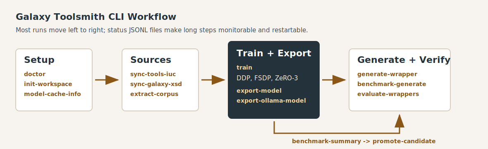

# CLI Reference

Galaxy Toolsmith exposes one command-line entrypoint:

```bash
gtsm [--repo-root <repo>] <command> [options]
```

Use `--repo-root` when running from outside the checkout. Relative paths are
resolved from that repository root unless an option explicitly describes a
different behavior. Most generated files are written under `.gtsm-cache/` by
default.



## Common Concepts

### Artifact Formats

`--artifact-format` controls the target wrapper representation.

| Value | Meaning |
| --- | --- |
| `xml` | Standard Galaxy tool XML. This is the default and the format used by Planemo lint/test. |
| `udt-yaml` | Galaxy User-Defined Tool YAML with `class: GalaxyUserTool`. This is schema-validated and can be conservatively converted to XML with `convert-udt`. |
| `mixed` | Training-only target mode. Uses real UDT YAML targets when a corpus record has `udt_yaml_path`; otherwise uses XML. |

### Source Context

Training, local generation, remote generation, and benchmark generation can
include underlying software source code when it is available in the corpus or
provided manually.

| Option | Meaning |
| --- | --- |
| `--source-context-mode none` | Do not include source context. |
| `--source-context-mode metadata` | Include source package metadata, URLs, versions, and checkout hints without file contents. |
| `--source-context-mode snippets` | Include a ranked subset of source files most likely to describe the CLI and runtime behavior. |
| `--source-context-mode all-filtered` | Include as much source as the prompt budget allows after filtering tests, generated files, vendored blobs, binary-like files, and low-signal paths. This is the preferred high-context mode for source-rich training runs. |
| `--source-context-mode all-raw` | Include source files with minimal filtering. Use only for diagnostics because it can waste context on tests, vendored code, and generated files. |
| `--source-context-max-chars <n>` | Maximum source-context characters added to a single prompt or training sample. |
| `--source-context-max-files <n>` | Maximum source files added to a single prompt or training sample. |
| `--source-root <dir>` | Scan a manual source tree for one-off generation or training input. |
| `--source-file <path>` | Include one manual source file for one-off generation or training input. |

When source checkout metadata comes from `extract-corpus`, the source context
loader uses the recorded package/version mappings and cached upstream source
trees. For archive downloads, the extracted source tree is used, not just the
conda recipe.

### Provider Selection

Generation commands use `--provider`:

| Provider | Use case | Configuration |
| --- | --- | --- |
| `local` | Local command, local Unsloth model, or local PEFT adapter manifest. | `GTSM_LOCAL_GENERATOR_CMD`, `GTSM_LOCAL_UNSLOTH_MODEL`, `GTSM_LOCAL_UNSLOTH_ADAPTER`, or `--model-variant`. |
| `ollama` | Quantized GGUF model served by Ollama. | `GTSM_OLLAMA_BASE_URL`, `GTSM_OLLAMA_MODEL`, `GTSM_OLLAMA_TIMEOUT_SECONDS`, `GTSM_OLLAMA_AUTH_HEADER`. |
| `openai` | OpenAI-compatible chat completion endpoint. | `GTSM_OPENAI_API_KEY`, optional `GTSM_OPENAI_BASE_URL`, `GTSM_OPENAI_MODEL`. |
| `anthropic` | Anthropic messages endpoint. | `GTSM_ANTHROPIC_API_KEY`, optional `GTSM_ANTHROPIC_BASE_URL`, `GTSM_ANTHROPIC_MODEL`. |
| `copilot` | GitHub Copilot-compatible chat endpoint. | `GTSM_COPILOT_API_KEY`, optional `GTSM_COPILOT_BASE_URL`, `GTSM_COPILOT_MODEL`. |

For long Ollama generations, set `GTSM_OLLAMA_TIMEOUT_SECONDS` high enough for
the model and token budget. Overnight benchmark runs commonly use `900` seconds
with `--max-tokens 8192`.

### Status Logs

Commands with `--status-log <jsonl>` stream structured progress events to both
console and the JSONL file. These logs are intended for long corpus extraction,
training, benchmark, server, and remote-worker runs.

## Setup and Introspection

### `doctor`

Print resolved workspace paths.

```bash
gtsm doctor
```

Use this first when paths look wrong. It prints the repository root, cache root,
source cache, dataset directory, runs directory, models directory, XSD cache,
and config directory.

### `init-config`

Write default configuration files.

```bash
gtsm init-config
```

This seeds the default project configuration without performing source sync or
corpus extraction.

### `init-workspace`

Create cache/config directories and seed manifest files.

```bash
gtsm init-workspace
```

Use this after installation or on a new machine. It prepares `.gtsm-cache/`,
dataset/model run directories, and default manifests.

### `runtime-detect`

Detect local runtime capabilities.

```bash
gtsm runtime-detect
```

Reports CPU, CUDA, ROCm, MPS, and related runtime information that affects local
training and inference choices.

### `model-cache-info`

Print resolved Hugging Face model cache settings.

```bash
gtsm model-cache-info
```

Use this to verify `GTSM_MODEL_CACHE_ROOT`, `HF_HOME`, `HUGGINGFACE_HUB_CACHE`,
`TRANSFORMERS_CACHE`, registry endpoint, revision pinning, and whether
`HF_TOKEN` is set.

### `estimate-model-resources`

Print coarse resource and cost estimate tiers for configured model profiles.

```bash
gtsm estimate-model-resources
```

This is a planning aid, not a scheduler. Confirm with dry runs and live GPU
telemetry before committing a long training run.

## Source Sync

### `sync-tools-iuc`

Clone or update the IUC tool repository into the source cache.

```bash
gtsm sync-tools-iuc --ref main
```

| Option | Meaning |
| --- | --- |
| `--ref <git-ref>` | Git ref to checkout. Defaults to `main`. |

The extracted corpus is normally built from the cached `tools-iuc/tools`
directory unless `extract-corpus --tools-root` points elsewhere.

### `sync-galaxy-skills`

Clone or update `galaxyproject-skills` into the source cache.

```bash
gtsm sync-galaxy-skills --ref main
```

| Option | Meaning |
| --- | --- |
| `--ref <git-ref>` | Git ref to checkout. Defaults to `main`. |

Prompt templates can use these skills as contextual guidance.

### `sync-galaxy-xsd`

Download/cache Galaxy's tool XML schema.

```bash
gtsm sync-galaxy-xsd --ref dev
```

| Option | Meaning |
| --- | --- |
| `--ref <git-ref>` | Galaxy git ref for the raw XSD. Defaults to `dev`. |

The cached XSD is used by XML evaluation when an XSD path is not supplied
explicitly.

## Corpus Extraction

### `extract-corpus`

Extract wrapper XML, expanded XML, tests, command signatures, datatypes,
requirements, tool help, optional container help, and optional source mappings
from a `tools-iuc` checkout.

```bash
gtsm extract-corpus \
  --max-workers 32 \
  --resolve-containers \
  --execute-containers \
  --container-runtime auto \
  --container-cache-dir .gtsm-cache/containers \
  --container-help-probe-mode exploratory \
  --bioconda-checkout-sources \
  --synthesize-udt-yaml \
  --status-log .gtsm-cache/logs/extract-corpus.status.jsonl
```

| Option | Meaning |
| --- | --- |
| `--tools-root <dir>` | Path to `tools-iuc/tools`. Defaults to the synced checkout. |
| `--output <jsonl>` | Corpus JSONL output path. Defaults to `.gtsm-cache/datasets/tools-iuc-corpus.jsonl`. |
| `--checkpoint <path>` | Checkpoint file for resumable extraction. Defaults beside the corpus output. |
| `--restart` | Archive existing output/checkpoint/index/execution artifacts and reprocess from scratch while keeping reusable caches. |
| `--status-log <jsonl>` | Write structured extraction progress. |
| `--max-workers <n>` | Parallel wrapper extraction workers. |
| `--retries <n>` | Per-tool parse retries. |
| `--no-fetch-docs` | Skip GitHub README fetching from `.shed.yml` homepages. Recommended for large source/container runs. |
| `--resolve-containers` | Resolve explicit containers, mulled/BioContainers names, and package-derived container candidates. |
| `--execute-containers` | Run resolved containers and capture command help text. Requires `--resolve-containers`. |
| `--container-runtime auto` | Use the best available runtime. `auto` prefers Singularity, then Apptainer, then Docker. |
| `--container-runtime singularity` | Require Singularity. |
| `--container-runtime apptainer` | Require Apptainer. |
| `--container-runtime docker` | Require Docker. |
| `--container-cache-dir <dir>` | Cache prepared Singularity/Apptainer images. Defaults to `.gtsm-cache/containers`. |
| `--container-help-probe-mode safe` | Probe conservative help forms only. |
| `--container-help-probe-mode exploratory` | Probe `--help`, `-h`, `help`, and no-argument forms in an isolated temporary directory. Default. |
| `--singularity-depot-url <url>` | Galaxy Singularity depot URL checked before `docker://` fallback. |
| `--docker-use-sudo` | Run Docker commands through `sudo docker` when Docker is selected. |
| `--no-remove-images` | Keep pulled images after execution instead of removing final-use images. |
| `--bioconda-checkout-sources` | Resolve conda recipes and checkout/download upstream package source. Starts with Bioconda recipes and can use conda-forge feedstocks when Bioconda is missing or unusable. |
| `--bioconda-ref <git-ref>` | Bioconda recipes ref for recipe/source resolution. Defaults to `master`. |
| `--synthesize-udt-yaml` | Write deterministic Galaxy User-Defined Tool YAML targets for each XML wrapper. This enables `udt-yaml` and `mixed` training when a repository does not ship native UDT files. |

Container execution records every attempted candidate, selected runtime, command
probe, return code, and help classification. Singularity/Apptainer is preferred
for Galaxy-compatible images; Docker is fallback only when selected directly or
when the automatic runtime path reaches Docker.

Source checkout mode resolves real upstream software source, not only recipes.
It supports archive URLs including HTTP(S) and FTP, git URLs, version-aware
recipe selection, and cached source extraction per package/version/channel.
Mappings record `source_channel` so downstream training can distinguish
Bioconda and conda-forge provenance.

Wrapper XML macro expansion uses Galaxy's `galaxy.tool_util.loader` path first,
which is the same macro machinery Planemo relies on internally. If Galaxy's
loader cannot parse a wrapper, extraction falls back to a lightweight local
expander so malformed or unusual wrappers still produce diagnostics instead of
stopping the entire corpus run.

When `--synthesize-udt-yaml` is enabled, extraction emits schema-valid UDT YAML
targets under the corpus dataset directory and records `udt_yaml_path` on each
wrapper record. The synthesized targets preserve the expanded wrapper command,
inputs, outputs, selected container, and help text where those fields map
directly from Galaxy XML.

### `rebuild-execution-report`

Rebuild the extraction execution report from an existing corpus JSONL file.

```bash
gtsm rebuild-execution-report \
  --corpus-jsonl .gtsm-cache/datasets/tools-iuc-corpus.jsonl \
  --output .gtsm-cache/datasets/tools-iuc-corpus.execution.json
```

| Option | Meaning |
| --- | --- |
| `--corpus-jsonl <jsonl>` | Corpus JSONL to summarize. Defaults to the standard corpus path. |
| `--output <json>` | Execution report output. Defaults to the corpus path with `.execution.json`. |

Use this when the corpus JSONL exists but the execution report needs to be
recreated after interruption or manual inspection.

### `diagnose-corpus`

Write QA diagnostics for a corpus extraction run.

```bash
gtsm diagnose-corpus \
  --execution-report .gtsm-cache/datasets/tools-iuc-corpus.execution.json \
  --diagnostics-dir .gtsm-cache/diagnostics
```

| Option | Meaning |
| --- | --- |
| `--execution-report <json>` | Extraction execution report to inspect. |
| `--corpus-jsonl <jsonl>` | Corpus JSONL path. Inferred from the execution report when omitted. |
| `--checkpoint <path>` | Checkpoint path. Inferred when omitted. |
| `--current-run <path>` | Current run pointer path. Defaults under the execution report directory. |
| `--diagnostics-dir <dir>` | Directory for diagnostic outputs. |
| `--sample-limit <n>` | Maximum non-help examples to include in sample diagnostics. |

## Training and Model Variants

### `list-train-profiles`

List configured training profiles.

```bash
gtsm list-train-profiles
```

Profiles live in `config/training.profiles.json`. They define the base model,
backend, batch sizing, default sequence length, LoRA settings, quantization
policy, and related runtime defaults.

### `train`

Run profile-based training and persist a model variant manifest.

```bash
gtsm train \
  --profile agentic-devstral-24b \
  --dataset-manifest config/dataset.manifest.json \
  --variant-id tools-iuc-devstral-24b-xml-source-allfiltered-12k \
  --corpus-jsonl .gtsm-cache/datasets/tools-iuc-corpus.jsonl \
  --artifact-format xml \
  --backend axolotl \
  --num-processes 3 \
  --distributed-strategy deepspeed-zero3-offload \
  --max-seq-length 12288 \
  --no-pad-to-sequence-len \
  --attn-implementation xformers \
  --per-device-batch-size 1 \
  --gradient-accumulation-steps 2 \
  --source-context-mode all-filtered \
  --source-context-max-chars 24000 \
  --source-context-max-files 96 \
  --status-log .gtsm-cache/logs/train.status.jsonl \
  --stream-logs \
  --post-export-quantizations q4_k_m \
  --post-ollama-model-name gtsm-tools-iuc-devstral-24b-xml-source-12k-q4
```

| Option | Meaning |
| --- | --- |
| `--profile <name>` | Training profile name. Defaults to `agentic-devstral-24b`. |
| `--dataset-manifest <json>` | Dataset manifest path. Defaults to `config/dataset.manifest.json`. |
| `--variant-id <id>` | Explicit model variant id. If omitted, one is generated. |
| `--command <args...>` | Trainer command override for `--backend command`. |
| `--corpus-jsonl <jsonl>` | Training corpus JSONL. |
| `--artifact-format xml|udt-yaml|mixed` | Training target format. |
| `--backend auto|axolotl|hf-sft|command` | Training backend. `auto` uses the profile. |
| `--num-processes <n>` | Local process count for Axolotl/torchrun style launches. Usually one per visible GPU. |
| `--distributed-strategy auto|ddp|fsdp|deepspeed-zero3|deepspeed-zero3-offload` | Multi-GPU strategy. |
| `--dry-run-backend` | Build backend inputs and print metadata without launching training. |
| `--max-seq-length <n>` | Override profile sequence length. |
| `--pad-to-sequence-len` | Pad samples to the full sequence length. |
| `--no-pad-to-sequence-len` | Do not force full-length padding. Useful for reducing memory pressure on long-context runs. |
| `--attn-implementation <name>` | Override Axolotl attention backend: `eager`, `sdpa`, `flash_attention_2`, `flash_attention_3`, `flex_attention`, `xformers`, `sage`, or `fp8`. |
| `--source-context-mode <mode>` | Include underlying source context in training samples. See [Source Context](#source-context). |
| `--source-context-max-chars <n>` | Per-sample source context character budget. |
| `--source-context-max-files <n>` | Per-sample source file count budget. |
| `--source-root <dir>` | Manual source tree for samples that need extra context. |
| `--source-file <path>` | Manual source file for samples that need extra context. |
| `--per-device-batch-size <n>` | Override profile per-device batch size. |
| `--gradient-accumulation-steps <n>` | Override profile gradient accumulation. |
| `--status-log <jsonl>` | Write training status events. |
| `--status-interval-seconds <seconds>` | Interval for live status events. Defaults to `30`. |
| `--stream-logs` | Emit incremental backend stdout/stderr chunks as status events. |
| `--log-tail-lines <n>` | Maximum new stdout/stderr lines per streamed event. |
| `--resume-from-checkpoint <path>` | Reserved for checkpoint resume integration. |
| `--post-export-quantizations <list>` | Comma-separated GGUF quantizations to export after successful training. |
| `--post-ollama-model-name <name>` | Generate an Ollama Modelfile for the post-exported quantized model. |
| `--post-ollama-create` | Run `ollama create` after generating the Modelfile. |

Distributed strategies have different memory and throughput tradeoffs:

| Strategy | Behavior |
| --- | --- |
| `ddp` | Full model replica per GPU. Fast when each GPU can hold the model, optimizer, activations, and batch. |
| `fsdp` | Shards model state across GPUs to reduce per-GPU memory. Useful for larger models or longer context. |
| `deepspeed-zero3` | DeepSpeed ZeRO-3 sharding across GPUs. |
| `deepspeed-zero3-offload` | ZeRO-3 plus CPU offload. Lower GPU memory pressure at the cost of throughput. |
| `auto` | Let the profile/backend choose. |

For long-context 24B tuning on three 40GB A100 GPUs, `deepspeed-zero3-offload`,
`--no-pad-to-sequence-len`, and an efficient attention backend can be more
practical than full model replication.

### `train-runs`

List local direct training runs.

```bash
gtsm train-runs --limit 20
```

| Option | Meaning |
| --- | --- |
| `--limit <n>` | Maximum runs to list. Defaults to `20`. |
| `--status-log <jsonl>` | Optional status event log. |

### `train-status`

Read status for a local direct training run.

```bash
gtsm train-status --run-id latest --tail 80
```

| Option | Meaning |
| --- | --- |
| `--run-id <id>` | Run id to inspect. Defaults to `latest`. |
| `--tail <n>` | Log tail length. Defaults to `80`. |
| `--status-log <jsonl>` | Optional status event log. |

### `list-model-variants`

List known model variant manifests.

```bash
gtsm list-model-variants
```

Variant manifests are written under the models cache and identify base model,
adapter artifacts, exported artifacts, and optional Ollama metadata.

## Export and Ollama Packaging

### `export-model`

Export model artifacts for a trained variant.

```bash
gtsm export-model \
  --variant-id tools-iuc-devstral-24b-xml-source-allfiltered-12k \
  --format all \
  --quantizations q8_0,q6_k,q5_k_m,q4_k_m
```

| Option | Meaning |
| --- | --- |
| `--variant-id <id>` | Required model variant id. |
| `--format all|merged|gguf` | Export merged model, GGUF, or both. |
| `--quantizations <list>` | Comma-separated GGUF quantization methods. Defaults to `q4_k_m`. |

Useful environment variables:

| Variable | Meaning |
| --- | --- |
| `GTSM_GGUF_BACKEND` | GGUF export backend. `auto` by default; `llama.cpp` can be forced. |
| `GTSM_LLAMA_CPP_DIR` | Directory containing llama.cpp conversion/quantization tools. |
| `GTSM_LLAMA_CPP_CONVERT` | Explicit converter path. |
| `GTSM_LLAMA_CPP_QUANTIZE` | Explicit quantizer path. |
| `GTSM_LLAMA_CPP_OUTTYPE` | Base GGUF output type, default `bf16`. |
| `GTSM_OLLAMA_CLI` | Optional path to the `ollama` executable used by `export-ollama-model --create`. |

### `export-ollama-model`

Generate an Ollama Modelfile and optionally register the model with Ollama.

```bash
gtsm export-ollama-model \
  --variant-id tools-iuc-devstral-24b-xml-source-allfiltered-12k \
  --model-name gtsm-tools-iuc-devstral-24b-xml-source-12k-q4 \
  --from-quantization q4_k_m \
  --create
```

| Option | Meaning |
| --- | --- |
| `--variant-id <id>` | Required model variant id. |
| `--model-name <name>` | Required Ollama model name. |
| `--from-quantization <name>` | Which exported quantization to reference. Defaults to `q4_k_m`. |
| `--create` | Run `ollama create` using the generated Modelfile. |

The training command can also do this after a successful run with
`--post-export-quantizations`, `--post-ollama-model-name`, and
`--post-ollama-create`.

## Generation and Conversion

### `generate-wrapper`

Generate one Galaxy tool artifact from help text and optional source context.

```bash
gtsm generate-wrapper \
  --provider ollama \
  --model gtsm-tools-iuc-devstral-24b-xml-source-12k-q4 \
  --tool-name bwa_mem \
  --help-text-file help.txt \
  --artifact-format xml \
  --source-context-mode all-filtered \
  --source-root source/bwa \
  --temperature 0 \
  --max-tokens 8192 \
  --output bwa_mem.xml
```

| Option | Meaning |
| --- | --- |
| `--tool-name <name>` | Required tool identifier/name. |
| `--help-text-file <path>` | Required command help text file. |
| `--artifact-format xml|udt-yaml` | Output artifact format. Defaults to XML. |
| `--source-file <path>` | Optional source file to add to the prompt. |
| `--source-context-mode <mode>` | Source-code context mode. |
| `--source-context-max-chars <n>` | Source context character budget. |
| `--source-context-max-files <n>` | Source file count budget. |
| `--source-root <dir>` | Source tree to scan. |
| `--provider local|openai|anthropic|copilot|ollama` | Generation provider. Defaults to `local`. |
| `--model <name>` | Provider model name override. |
| `--temperature <float>` | Sampling temperature. Defaults to `0.1`. |
| `--max-tokens <n>` | Maximum output tokens for external providers. Defaults to `4096`. |
| `--max-prompt-help-chars <n>` | Maximum help text characters included in the prompt. |
| `--model-variant <id>` | Variant label stored in generation metadata. |
| `--skills-profile <name>` | Prompt skills profile. Defaults to `default`. |
| `--allow-stub-local` | Permit canned local XML when no real local model is configured. Use only for smoke tests. |
| `--output <path>` | Required output artifact path. |

### `generate-wrapper-remote`

Generate one artifact through a running `gtsm serve` endpoint.

```bash
gtsm generate-wrapper-remote \
  --server-url http://127.0.0.1:8765 \
  --tool-name bwa_mem \
  --help-text-file help.txt \
  --artifact-format xml \
  --provider ollama \
  --model gtsm-tools-iuc-devstral-24b-xml-source-12k-q4 \
  --output bwa_mem.xml
```

| Option | Meaning |
| --- | --- |
| `--server-url <url>` | Server base URL. Defaults to `http://127.0.0.1:8765`. |
| `--auth-token-env <name>` | Environment variable containing bearer token. Defaults to `GTSM_SERVER_AUTH_TOKEN`. |
| `--tool-name <name>` | Required tool identifier/name. |
| `--help-text-file <path>` | Required help text file. |
| `--source-file <path>` | Optional source file to send. |
| `--artifact-format xml|udt-yaml` | Artifact format. |
| `--provider <name>` | Provider requested from the server. |
| `--model <name>` | Provider model override. |
| `--model-variant <id>` | Variant metadata label. |
| `--skills-profile <name>` | Prompt skills profile. |
| `--temperature <float>` | Sampling temperature. |
| `--max-tokens <n>` | Maximum output tokens. |
| `--max-prompt-help-chars <n>` | Maximum help text characters in prompt. |
| `--output <path>` | Required output artifact path. |

### `convert-udt`

Convert Galaxy User-Defined Tool YAML to standard Galaxy tool XML.

```bash
gtsm convert-udt \
  --input tool.yml \
  --output tool.xml \
  --report tool.udt-conversion.json
```

| Option | Meaning |
| --- | --- |
| `--input <tool.yml>` | Required UDT YAML input. |
| `--output <tool.xml>` | Required Galaxy XML output. |
| `--report <json>` | Optional validation/conversion report. |
| `--allow-lossy-conversion` | Permit XML output when unsupported UDT expressions must be preserved with notes. |

Without `--allow-lossy-conversion`, unsupported JavaScript expressions and other
non-conservative conversions fail rather than silently changing semantics.

## Server and Remote Training

### `serve`

Run the optional HTTP inference and coordination server.

```bash
gtsm serve \
  --host 0.0.0.0 \
  --port 8765 \
  --provider local \
  --auth-tokens-file .gtsm-cache/server.tokens \
  --require-generate-auth \
  --status-log .gtsm-cache/logs/server.status.jsonl
```

| Option | Meaning |
| --- | --- |
| `--host <host>` | Bind host. Defaults to `127.0.0.1`. |
| `--port <port>` | Bind port. Defaults to `8765`. |
| `--stop` | Stop matching running `gtsm serve` processes instead of starting a server. |
| `--provider <name>` | Default provider for server-side generation. |
| `--model <name>` | Default model override. |
| `--model-variant <id>` | Default model variant label. |
| `--temperature <float>` | Default generation temperature. |
| `--max-tokens <n>` | Default max output tokens. |
| `--max-prompt-help-chars <n>` | Default help text prompt budget. |
| `--auth-token-env <name>` | Environment variable containing a bearer token. |
| `--auth-token <token>` | Explicit bearer token. Repeatable. |
| `--auth-tokens-file <path>` | File containing one bearer token per line. |
| `--require-generate-auth` | Require auth for `/generate` when tokens are configured. |
| `--allow-stub-local` | Allow canned local XML for smoke tests. |
| `--status-log <jsonl>` | Write server status events. |
| `--dry-run` | With `--stop`, list matching processes without stopping. |
| `--force` | With `--stop`, use SIGKILL for processes still alive after SIGTERM. |
| `--timeout-seconds <seconds>` | With `--stop`, wait time after SIGTERM. |
| `--detach` | Run server as a detached background process. |
| `--detach-log <path>` | Stdout/stderr log for detached mode. |

The browser monitor is available at `/monitor`. The training-job API is exposed
under `/train/jobs` for the coordinator/worker path.

### `serve-stop`

Stop running `gtsm serve` processes for this checkout.

```bash
gtsm serve-stop --port 8765 --force
```

| Option | Meaning |
| --- | --- |
| `--host <host>` | Optional host filter. |
| `--port <port>` | Port filter. Defaults to `8765`. |
| `--all-ports` | Ignore `--port` and stop all matching server processes for this checkout. |
| `--dry-run` | List matching processes without stopping. |
| `--force` | Use SIGKILL for processes still alive after SIGTERM. |
| `--timeout-seconds <seconds>` | Wait time after SIGTERM. |

### `train-remote-submit`

Submit a training job to a server-coordinated worker pool.

```bash
gtsm train-remote-submit \
  --server-url http://127.0.0.1:8765 \
  --profile agentic-devstral-24b \
  --dataset-manifest config/dataset.manifest.json \
  --corpus-jsonl .gtsm-cache/datasets/tools-iuc-corpus.jsonl
```

| Option | Meaning |
| --- | --- |
| `--server-url <url>` | Coordinator server URL. |
| `--auth-token-env <name>` | Environment variable containing bearer token. |
| `--profile <name>` | Training profile. |
| `--dataset-manifest <json>` | Dataset manifest. |
| `--corpus-jsonl <jsonl>` | Corpus JSONL. |
| `--variant-id <id>` | Optional variant id. |
| `--command <args...>` | Optional trainer command override. |

### `train-remote-status`

Read status for a remote training job.

```bash
gtsm train-remote-status \
  --server-url http://127.0.0.1:8765 \
  --job-id <job-id> \
  --status-log .gtsm-cache/logs/train-status.jsonl
```

| Option | Meaning |
| --- | --- |
| `--server-url <url>` | Coordinator server URL. |
| `--auth-token-env <name>` | Environment variable containing bearer token. |
| `--job-id <id>` | Required remote job id. |
| `--status-log <jsonl>` | Optional status log. |

### `train-worker`

Run a worker that claims training jobs from the coordinator server.

```bash
CUDA_VISIBLE_DEVICES=0 gtsm train-worker \
  --server-url http://127.0.0.1:8765 \
  --worker-id gpu0 \
  --status-log .gtsm-cache/logs/worker-gpu0.status.jsonl
```

| Option | Meaning |
| --- | --- |
| `--server-url <url>` | Coordinator server URL. |
| `--auth-token-env <name>` | Environment variable containing bearer token. |
| `--worker-id <id>` | Optional stable worker id. |
| `--poll-seconds <seconds>` | Poll interval. Defaults to `2`. |
| `--lease-seconds <seconds>` | Job lease duration. Defaults to `180`. |
| `--max-jobs <n>` | Maximum jobs before exit. `0` means unlimited. |
| `--once` | Exit after first claim attempt. |
| `--detach` | Run worker in the background. |
| `--detach-log <path>` | Stdout/stderr log for detached mode. |
| `--status-log <jsonl>` | Optional worker status log. |

Use `CUDA_VISIBLE_DEVICES` to pin one worker to one GPU for full-model-per-GPU
parallelism. Use a single `train` command with multiple processes and a sharded
distributed strategy when the model or context length is too large for one GPU.

### `train-artifacts-fetch`

Fetch remote training artifacts from the server in parallel.

```bash
gtsm train-artifacts-fetch \
  --server-url http://127.0.0.1:8765 \
  --job-id <job-id> \
  --output-dir .gtsm-cache/models/remote-artifacts \
  --max-workers 8
```

| Option | Meaning |
| --- | --- |
| `--server-url <url>` | Coordinator server URL. |
| `--auth-token-env <name>` | Environment variable containing bearer token. |
| `--job-id <id>` | Required remote job id. |
| `--output-dir <dir>` | Artifact output directory. |
| `--max-workers <n>` | Parallel download workers. Defaults to `4`. |

## Evaluation, Benchmarking, and Promotion

### `evaluate-wrappers`

Validate and summarize generated wrapper artifacts.

```bash
gtsm evaluate-wrappers \
  --wrappers generated/*.xml \
  --artifact-format xml \
  --report .gtsm-cache/runs/evaluation/summary.json \
  --run-planemo \
  --run-planemo-tests \
  --planemo-galaxy-root .gtsm-cache/planemo/galaxy \
  --planemo-conda-prefix .gtsm-cache/planemo/conda \
  --planemo-engine galaxy \
  --planemo-test-timeout 900
```

| Option | Meaning |
| --- | --- |
| `--wrappers <paths...>` | Required wrapper/artifact paths. |
| `--artifact-format xml|udt-yaml` | Artifact format. Defaults to XML. |
| `--report <json>` | Evaluation summary JSON output. |
| `--xsd <path>` | Optional Galaxy XSD for XML validation. |
| `--run-planemo` | Run `planemo lint` for each XML wrapper when available. |
| `--run-planemo-tests` | Run `planemo test` for each XML wrapper. |
| `--planemo-test-output-dir <dir>` | Directory for Planemo reports. Defaults beside the evaluation report. |
| `--planemo-test-timeout <seconds>` | Per-test timeout. `0` leaves Planemo default unchanged. |
| `--planemo-galaxy-root <dir>` | Pass cached Galaxy root to Planemo. |
| `--planemo-install-galaxy` | Pass `--install_galaxy` to Planemo. |
| `--planemo-engine galaxy|docker_galaxy|cwltool|toil|external_galaxy` | Planemo engine. |
| `--planemo-conda-prefix <dir>` | Pass cached conda prefix to Planemo. |
| `--planemo-test-data <dir>` | Test-data directory for Planemo. |
| `--planemo-extra-tools <path>` | Extra tool source for Planemo. Repeatable. |
| `--planemo-no-dependency-resolution` | Disable Planemo dependency resolution. Avoid this when validating real generated wrappers. |

For `udt-yaml`, evaluation validates against the vendored Galaxy
`UserToolSource` JSON schema. Planemo lint/test is XML-only, so convert
successful UDT artifacts with `convert-udt` before Planemo testing.

### `benchmark-generate`

Run corpus-scale generation and evaluation.

```bash
GTSM_OLLAMA_TIMEOUT_SECONDS=900 gtsm benchmark-generate \
  --corpus-jsonl .gtsm-cache/datasets/tools-iuc-corpus.jsonl \
  --wrappers-dir .gtsm-cache/runs/benchmark/wrappers \
  --generation-records .gtsm-cache/runs/benchmark/generation.records.json \
  --evaluation-report .gtsm-cache/runs/benchmark/evaluation.summary.json \
  --benchmark-summary .gtsm-cache/runs/benchmark/benchmark.summary.json \
  --provider ollama \
  --model gtsm-tools-iuc-devstral-24b-xml-source-12k-q4 \
  --artifact-format xml \
  --temperature 0 \
  --max-tokens 8192 \
  --max-workers 1 \
  --record-timeout-seconds 1200 \
  --source-context-mode all-filtered \
  --source-context-max-chars 24000 \
  --source-context-max-files 96 \
  --limit 100 \
  --status-log .gtsm-cache/runs/benchmark/status.jsonl
```

| Option | Meaning |
| --- | --- |
| `--corpus-jsonl <jsonl>` | Input corpus JSONL. |
| `--wrappers-dir <dir>` | Directory for generated artifacts. |
| `--artifact-format xml|udt-yaml` | Artifact format to generate. |
| `--generation-records <json>` | Per-tool generation record output. |
| `--evaluation-report <json>` | Evaluation summary output. |
| `--benchmark-summary <json>` | Benchmark summary output. |
| `--provider <name>` | Generation provider. |
| `--model-variant <id>` | Variant label for metadata and local PEFT lookup. |
| `--model <name>` | Provider model override. |
| `--temperature <float>` | Sampling temperature. |
| `--max-tokens <n>` | Maximum output tokens. |
| `--max-workers <n>` | In-process generation workers. |
| `--num-processes <n>` | Native benchmark worker processes for local generation. `0` auto-selects. |
| `--gpu-devices <ids>` | Comma-separated GPU ids for benchmark workers, for example `0,1,2,3`. |
| `--min-items-per-process <n>` | Minimum items per auto-selected worker process. |
| `--startup-stagger-seconds <seconds>` | Delay between native worker launches. |
| `--local-gpu-topology per-process|model-parallel` | Local benchmark topology. `per-process` binds workers to GPUs; `model-parallel` lets one local model span GPUs. |
| `--local-offload-policy allow|fail` | Whether local PEFT inference may use CPU/disk/model offload. |
| `--local-gpu-memory-reserve-gib <gib>` | Per-GPU memory reserve when computing local PEFT `max_memory`. |
| `--resume-existing` | Skip successful checkpointed records with existing outputs. |
| `--checkpoint-records <jsonl>` | Per-record benchmark checkpoint path. |
| `--record-timeout-seconds <seconds>` | Parent-enforced timeout for one active record. `0` disables. |
| `--max-prompt-help-chars <n>` | Maximum help text characters in each prompt. |
| `--source-context-mode <mode>` | Source-code context mode. |
| `--source-context-max-chars <n>` | Source context character budget. |
| `--source-context-max-files <n>` | Source file count budget. |
| `--source-root <dir>` | Manual source tree to scan. |
| `--repair-invalid-xml` | Retry malformed/non-tool/degenerate XML once with a stricter prompt. Enabled by default. |
| `--no-repair-invalid-xml` | Disable automatic XML repair retry. |
| `--allow-compact-fallback` | After a truncated XML generation and failed repair, write a minimal placeholder wrapper. Off by default; use only for smoke tests, not quality benchmarks. |
| `--limit <n>` | Maximum corpus records to attempt. |
| `--xsd <path>` | Optional Galaxy XSD path. |
| `--run-planemo` | Run Planemo lint during evaluation. |
| `--run-planemo-tests` | Run Planemo tests during evaluation. Prefer separate post-generation Planemo runs for large benchmarks. |
| `--allow-stub-local` | Permit canned local XML for smoke tests. |
| `--status-log <jsonl>` | Optional benchmark status log. |

For large local inference benchmarks there are two useful GPU modes:

| Mode | How to run it | Tradeoff |
| --- | --- | --- |
| Full model per GPU | `--num-processes <gpus> --gpu-devices 0,1,2,3 --local-gpu-topology per-process` | Higher throughput when each GPU can hold one full model. |
| Shared model across GPUs | `--num-processes 1 --local-gpu-topology model-parallel` | Lower concurrency but allows larger models or longer contexts through memory sharing/offload. |

For Ollama benchmarks, keep `--max-workers 1` unless the Ollama server and model
can handle concurrent generations without thrashing.

### `benchmark-summary`

Print a compact human-readable summary from a benchmark summary JSON.

```bash
gtsm benchmark-summary \
  --summary .gtsm-cache/runs/benchmark/benchmark.summary.json
```

| Option | Meaning |
| --- | --- |
| `--summary <json>` | Benchmark summary path. |

### `promote-candidate`

Apply promotion quality gates to candidate benchmark outputs.

```bash
gtsm promote-candidate \
  --candidate-summary .gtsm-cache/runs/benchmark/benchmark.summary.json \
  --baseline-summary .gtsm-cache/runs/baseline/benchmark.summary.json \
  --policy staging \
  --require-planemo-test-pass
```

| Option | Meaning |
| --- | --- |
| `--candidate-summary <json>` | Required candidate benchmark summary. |
| `--baseline-summary <json>` | Optional baseline summary for regression checks. |
| `--decision-out <json>` | Promotion decision output. |
| `--policy <name>` | Policy profile from `config/promotion.policies.json`. Defaults to `staging`. |
| `--min-generation-success-rate <float>` | Override policy threshold. |
| `--min-xml-well-formed-rate <float>` | Override policy threshold. |
| `--max-unknown-datatype-rate <float>` | Override policy threshold. |
| `--require-xsd-pass` | Require XSD validation pass. |
| `--require-planemo-pass` | Require Planemo lint pass. |
| `--require-planemo-test-pass` | Require Planemo test pass. |
| `--baseline-tolerance <float>` | Allowed regression tolerance against baseline. |

### `list-promotion-policies`

List configured promotion policy profiles.

```bash
gtsm list-promotion-policies
```

## Environment Variables

| Variable | Used by | Meaning |
| --- | --- | --- |
| `GTSM_MODEL_SOURCE_REGISTRY` | Training/export/local inference | Hugging Face-compatible registry endpoint. Falls back to `HF_ENDPOINT`. |
| `GTSM_MODEL_REVISION` | Training/export/local inference | Model revision pin. |
| `GTSM_MODEL_CACHE_ROOT` | Training/export/local inference | Model cache root. Falls back to `HF_HOME`; otherwise defaults under `.gtsm-cache/models/hf-cache`. |
| `HUGGINGFACE_HUB_CACHE` | Training/export/local inference | Explicit Hugging Face Hub cache directory. |
| `TRANSFORMERS_CACHE` | Training/export/local inference | Explicit Transformers cache directory. |
| `GTSM_MODEL_LOCAL_FILES_ONLY` | Training/export/local inference | Treat model loading as offline/local-only when truthy. |
| `HF_TOKEN` | Hugging Face downloads | Optional token for rate limits/private models. |
| `GTSM_LOCAL_GENERATOR_CMD` | `--provider local` | External command that reads generation JSON on stdin and writes an artifact on stdout. |
| `GTSM_LOCAL_UNSLOTH_MODEL` | `--provider local` | Local Unsloth model name/path. |
| `GTSM_LOCAL_UNSLOTH_ADAPTER` | `--provider local` | Optional LoRA adapter for the Unsloth model. |
| `GTSM_OLLAMA_BASE_URL` | `--provider ollama` | Ollama server base URL. Defaults to `http://127.0.0.1:11434`. |
| `GTSM_OLLAMA_MODEL` | `--provider ollama` | Default Ollama model when `--model` is omitted. |
| `GTSM_OLLAMA_TIMEOUT_SECONDS` | `--provider ollama` | `urlopen` timeout for Ollama calls. Defaults to `120`. |
| `GTSM_OLLAMA_AUTH_HEADER` | `--provider ollama` | Optional auth header, either full authorization value or `Header: value`. |
| `GTSM_OPENAI_API_KEY` | `--provider openai` | Required OpenAI provider API key. |
| `GTSM_OPENAI_BASE_URL` | `--provider openai` | Optional OpenAI-compatible chat completions URL. |
| `GTSM_OPENAI_MODEL` | `--provider openai` | Default OpenAI model. |
| `GTSM_ANTHROPIC_API_KEY` | `--provider anthropic` | Required Anthropic provider API key. |
| `GTSM_ANTHROPIC_BASE_URL` | `--provider anthropic` | Optional Anthropic messages URL. |
| `GTSM_ANTHROPIC_MODEL` | `--provider anthropic` | Default Anthropic model. |
| `GTSM_COPILOT_API_KEY` | `--provider copilot` | Required Copilot provider API key. |
| `GTSM_COPILOT_BASE_URL` | `--provider copilot` | Optional Copilot-compatible chat URL. |
| `GTSM_COPILOT_MODEL` | `--provider copilot` | Default Copilot model. |
| `GTSM_SERVER_AUTH_TOKEN` | Server/client/remote training | Default bearer token environment variable. Override flag name with `--auth-token-env`. |
| `GTSM_GGUF_BACKEND` | `export-model` | GGUF backend selector. |
| `GTSM_LLAMA_CPP_DIR` | `export-model` | llama.cpp tool directory. |
| `GTSM_LLAMA_CPP_CONVERT` | `export-model` | Explicit conversion binary path. |
| `GTSM_LLAMA_CPP_QUANTIZE` | `export-model` | Explicit quantization binary path. |
| `GTSM_LLAMA_CPP_OUTTYPE` | `export-model` | Base GGUF output type. |
| `GTSM_OLLAMA_CLI` | `export-ollama-model --create` | Path to the Ollama CLI when it is not on `PATH`. |
| `CUDA_VISIBLE_DEVICES` | Training/benchmark workers | GPU visibility and per-worker binding. |
| `APPTAINER_CACHEDIR` | Container extraction | Apptainer cache directory. |
| `SINGULARITY_CACHEDIR` | Container extraction | Singularity cache directory. |

## Optional Live Tests

These tests are skipped during the normal unit suite.

```bash
make test-optional-planemo PLANEMO_TEST_GALAXY_ROOT=/path/to/galaxy
make test-optional-planemo PLANEMO_TEST_INSTALL_GALAXY=1
make test-optional-ollama OLLAMA_TEST_GGUF=/absolute/path/model.gguf
```

Direct pytest runs use `GTSM_TEST_LIVE_PLANEMO=1` or
`GTSM_TEST_LIVE_OLLAMA=1` plus the matching runtime configuration.
